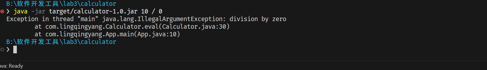
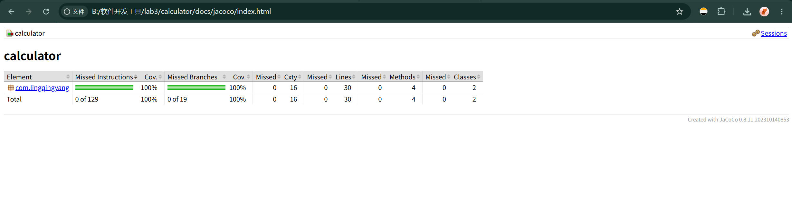
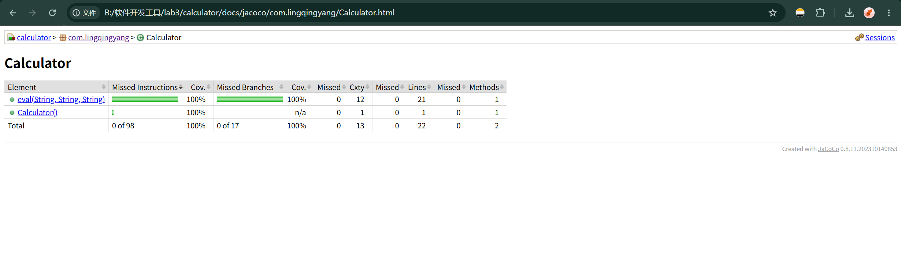
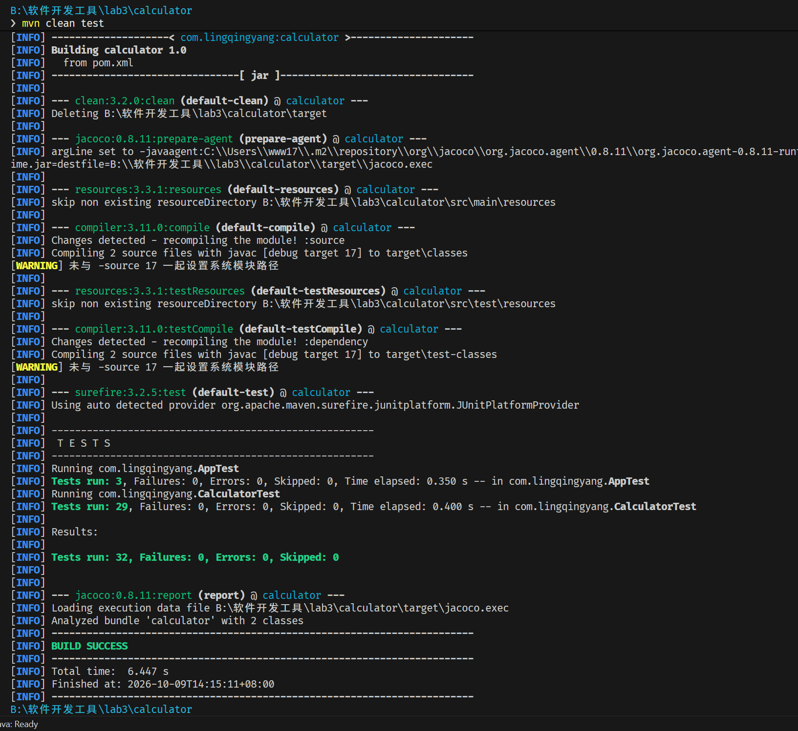
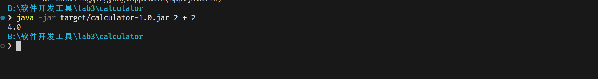

# 实验 4 实验报告：计算器单元测试与 JaCoCo 覆盖率

- **GitHub ID**：Ling-Qingyang
- **包名**：`com.lingqingyang`
- **运行环境**：Java 17, Maven 3.8+
- **测试框架**：JUnit 5 (5.10.0), AssertJ (3.25.3), JaCoCo (0.8.11)

---

## 1. 实验需求与实现对照

| 需求项 | 实验要求 | 实际实现 | 状态 |
| :--- | :--- | :--- | :--- |
| 1. 运算测试 | 覆盖加、减、乘运算 | 包含正数、负数、零、小数及首尾空格用例 | 已实现 |
| 2. 除以零测试 | 捕获除零异常，使用 `assertThrows` | 使用 JUnit `assertThrows` 与 AssertJ `assertThatThrownBy` | 已实现 |
| 3. 参数化测试 | 编写 5 组以上测试用例 | 实现 10 组运算参数化用例与 4 组空白输入参数化用例 | 已实现 |
| 4. 覆盖率要求 | 行覆盖率 ≥ 80% | `Calculator` 行覆盖率 100%，分支覆盖率 100% | 已实现 |
| 5. 错误分支修复 | 覆盖并修复测试发现的异常分支 | 包含空白输入、Null、非数字字符、未知操作符、除以零处理 | 已实现 |
| 6. 加分项 (Bonus) | 使用 AssertJ 替代原生断言 | 使用 AssertJ 断言方法（`assertThat`, `assertThatThrownBy`） | 已实现 |

---

## 2. 单元测试用例分布

测试类：`CalculatorTest.java`（29 个用例）、`AppTest.java`（3 个用例），共 32 个用例。

1. **运算测试**：
   - 加法 (`testAdd`)：正数、负数、异号、小数、加零、首尾空格。
   - 减法 (`testSubtract`)：正数、负数、结果为负、小数。
   - 乘法 (`testMultiply`)：正数、负数、乘零、小数。
   - 除法及其他 (`testDivide`, `testPowerAndModulo`)：除法、幂运算 (`^`)、取模运算 (`%`)。

2. **除以零测试**：
   - 输入 `/ 0`、`/ 0.0`、`/ -0.0`、`% 0`、`% 0.0`。
   - 抛出 `IllegalArgumentException`，信息为 `"division by zero"`。
   - 终端除零运行捕获：
     

3. **参数化测试**：
   - `@ParameterizedTest` + `@CsvSource`：10 组四则及乘方取模运算用例。
   - `@ParameterizedTest` + `@CsvSource`：4 组空字符串与空格用例。
   - `@ParameterizedTest` + `@ValueSource`：5 组未知操作符用例。

4. **异常分支处理**：
   - 操作数为空字符串、空格或 null：抛出 `IllegalArgumentException("input is blank")`。
   - 操作符为空字符串、空格或 null：抛出 `IllegalArgumentException("operator is blank")`。
   - 非数字字符串：捕获 `NumberFormatException` 并抛出 `IllegalArgumentException`。
   - 未知操作符：抛出 `IllegalArgumentException("unknown operator: ...")`。

---

## 3. JaCoCo 覆盖率数据

报告文件路径：`target/site/jacoco/index.html`

| 类名 | 指令覆盖率 | 分支覆盖率 | 行覆盖率 | 复杂度覆盖率 | 方法覆盖率 |
| :--- | :---: | :---: | :---: | :---: | :---: |
| `com.lingqingyang.Calculator` | 100% (98/98) | 100% (17/17) | 100% (22/22) | 100% (13/13) | 100% (2/2) |
| `com.lingqingyang.App` | 100% (31/31) | 100% (2/2) | 100% (8/8) | 100% (3/3) | 100% (2/2) |
| **总计** | **100% (129/129)** | **100% (19/19)** | **100% (30/30)** | **100% (16/16)** | **100% (4/4)** |

### 覆盖率截图

- JaCoCo 覆盖率总览：
  

- Calculator 类覆盖详情：
  

---

## 4. 验证命令与输出

1. 运行测试：
   ```bash
   mvn clean test
   ```
   输出：`Tests run: 32, Failures: 0, Errors: 0, Skipped: 0`。

   - 测试执行通过终端截图：
     

2. 打包与执行：
   ```bash
   mvn package
   java -jar target/calculator-1.0.jar 2 + 2
   ```
   输出：`4.0`。

   - 命令行打包运行终端截图：
     
